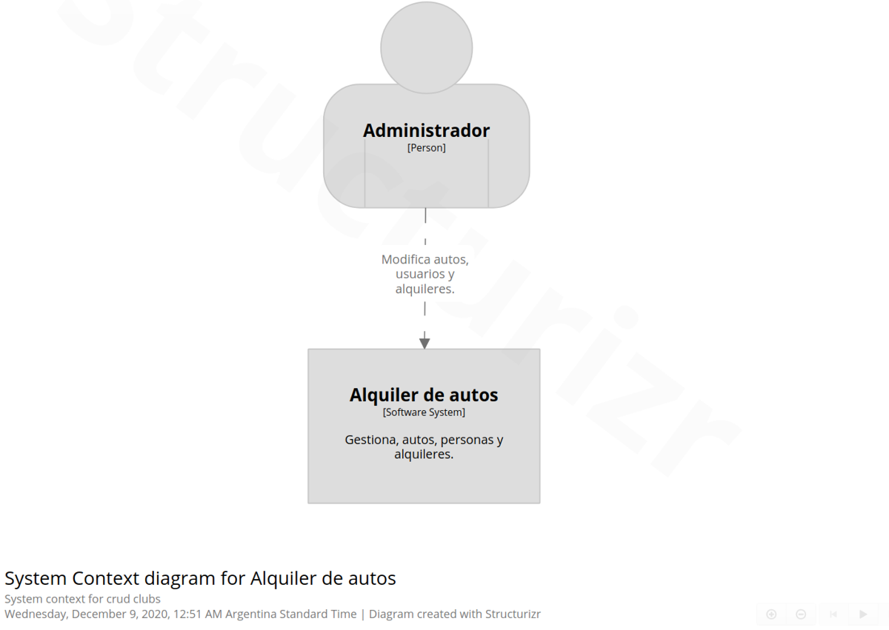
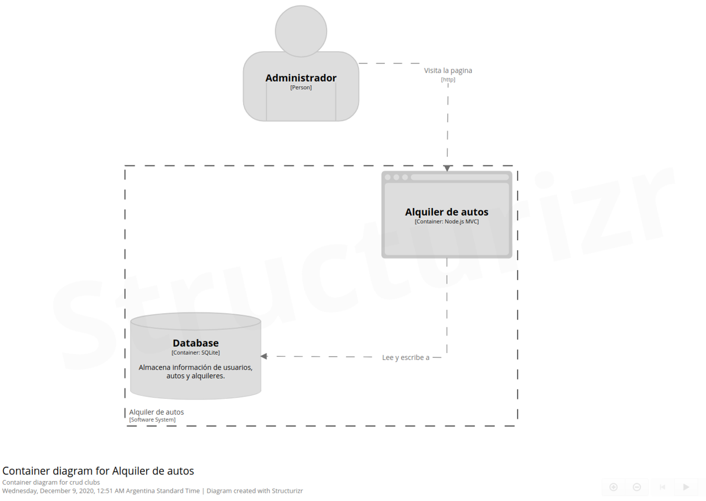
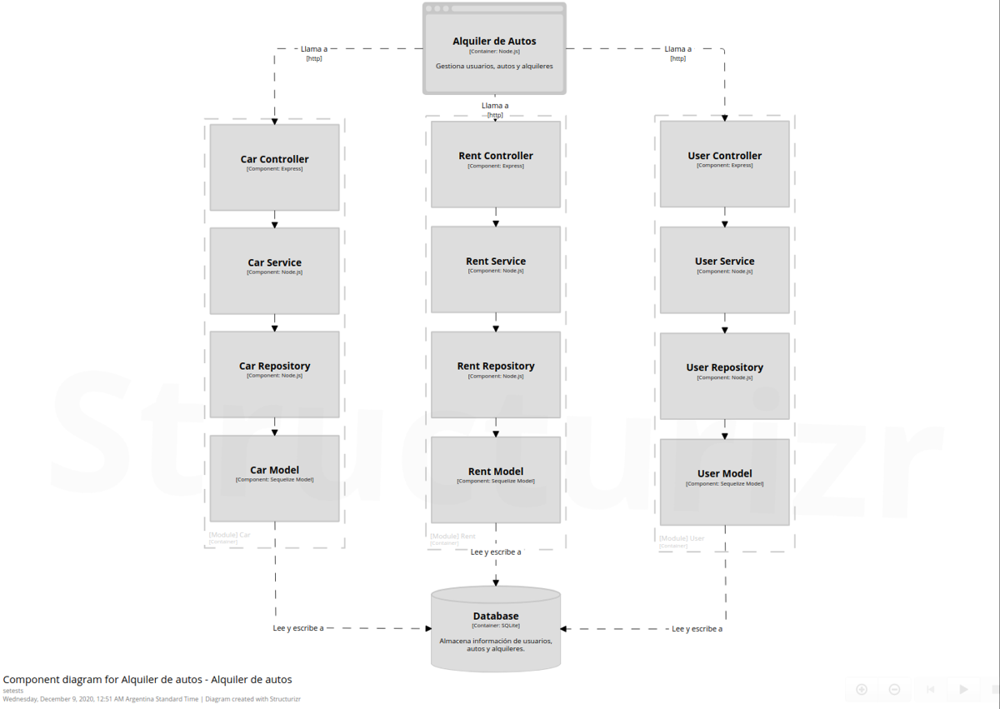

# CRUD/ABM Alquiler autos

## Overview
Sistema de alquiler de autos (backoffice)

## Correr localmente
1. Clone this project locally.
2. Correr en la consola `npm install`.  
3. Copiar y pegar el contenido de .env.dist en un nuevo archivo llamado .env  
4. Correr `npm run dev` y abrir en el navegador una ventana en [http://localhost:8080](http://localhost:8080)  

## Dependencias
- [connect-session-sequelize](https://www.npmjs.com/package/connect-session-sequelize)
- [dotenv](https://www.npmjs.com/package/dotenv)
- [express](http://expressjs.com/)
- [express-session](https://www.npmjs.com/package/express-session)
- [multer](https://www.npmjs.com/package/multer)
- [nunjucks](https://mozilla.github.io/nunjucks/)
- [rsdi](https://www.npmjs.com/package/rsdi)
- [sequelize](https://sequelize.org/)
- [sqlite3](https://www.npmjs.com/package/sqlite3)

## Dependencias de desarrollo
- [@types/jest](https://www.npmjs.com/package/@types/jest)
- [eslint](https://eslint.org/)
- [eslint-config-airbnb-base](https://www.npmjs.com/package/eslint-config-airbnb-base)
- [eslint-plugin-import](https://www.npmjs.com/package/eslint-plugin-import)
- [jest](https://jestjs.io/docs/en/getting-started)
- [jsdoc](https://jsdoc.app/)
- [nodemon](https://www.npmjs.com/package/nodemon)

## Diagramas

